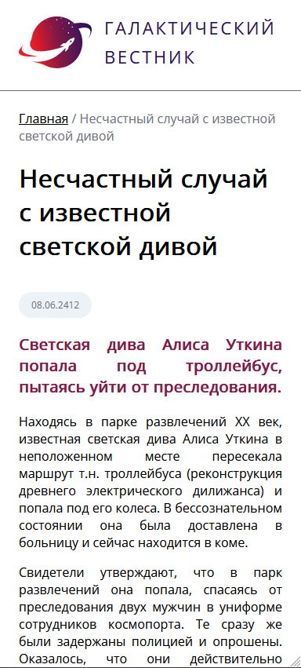

# GalaxyNews
Сайт доступен по ссылке: https://galaxynews.onrender.com.

Может потребоваться некоторое время для запуска веб-службы, так как она останавливается в период отсутствия внешних запросов.


## Стек проекта
- HTML5
- CSS3
- C#
	- ASP.NET
	- Entity Framework
- PostgreSQL
- Render (облачный хостинг)

## Перед запуском
* Импортировать SQL-дамп (см. **SqlDumps/GalaxyNews.sql**)
* Создать переменную среды "galaxynews_cs", содержащую в себе строку подключения к базе данных. Пример строки подключения: ```Host=localhost;Username=postgres;Password=1234;Port=5432;Database=postgres```

## Скриншоты


