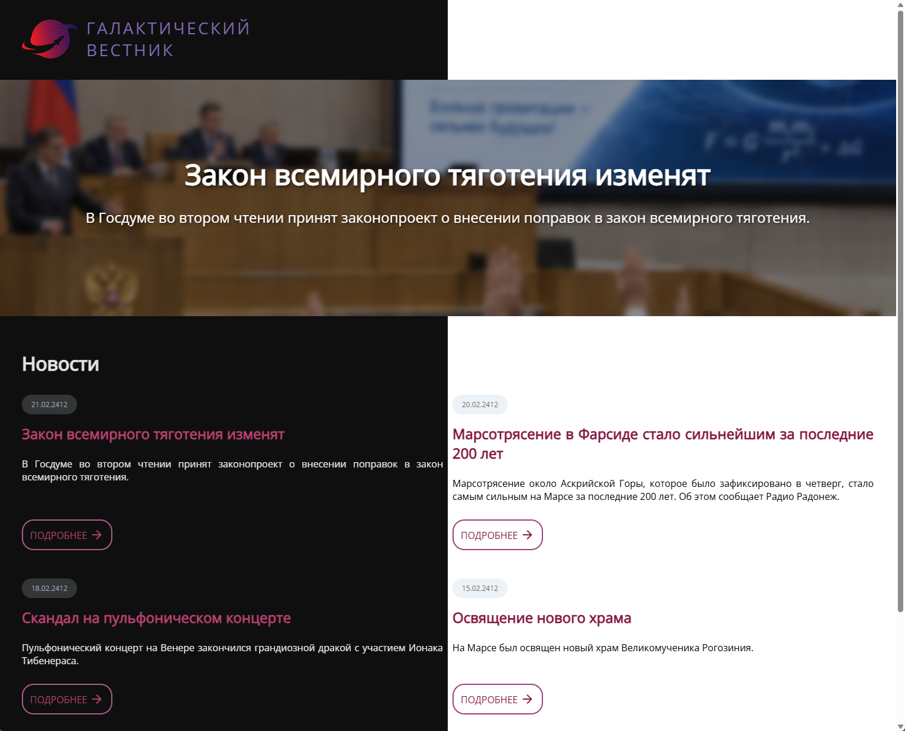
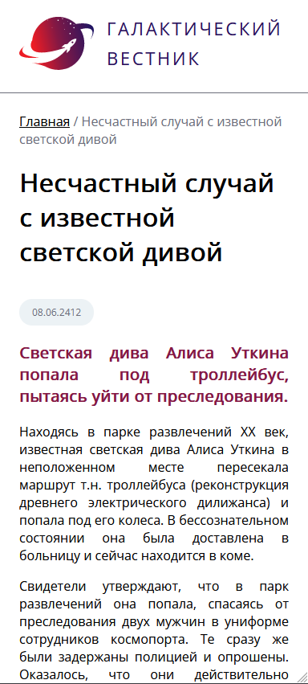

# GalaxyNews
Проект, демонстрирующий базовые возможности платформы .NET в сфере веб-разработки.

Сайт доступен по ссылке: https://galaxynews.onrender.com.

> [!NOTE]
> Для запуска веб-службы может потребоваться некоторое время, так как она останавливается в период длительного отсутствия внешних запросов.

> [!WARNING]
> Доступ к приложениям на платформе Render через российских провайдеров может быть затруднён в связи с жёсткими ограничениями интернета в стране.

## Стек проекта
- HTML5
- CSS3
- C#
	- ASP.NET Core
	- Entity Framework Core
   	- Npgsql
- PostgreSQL
- [Render](https://render.com) (облачный хостинг)

## Запуск проекта
### Необходимые шаги перед запуском
* Импортировать SQL-дамп в базу данных PostgreSQL (см. [SqlDumps/GalaxyNewsDb.sql](https://github.com/uthef/GalaxyNews/blob/master/SqlDumps/GalaxyNewsDb.sql))
* Создать переменную среды "galaxynews_cs", содержащую в себе строку подключения к базе данных. Структура строки подключения: ```Host=localhost;Username=postgres;Password=1234;Port=5432;Database=postgres```

### Один из способов запуска веб-приложения через терминал PowerShell
```powershell
$env:galaxynews_cs='Database=dbname;Username=dbuser;Password=12345678;Port=5432;Host=dbhost.com;'
dotnet run --project GalaxyNews
```

## Скриншоты


